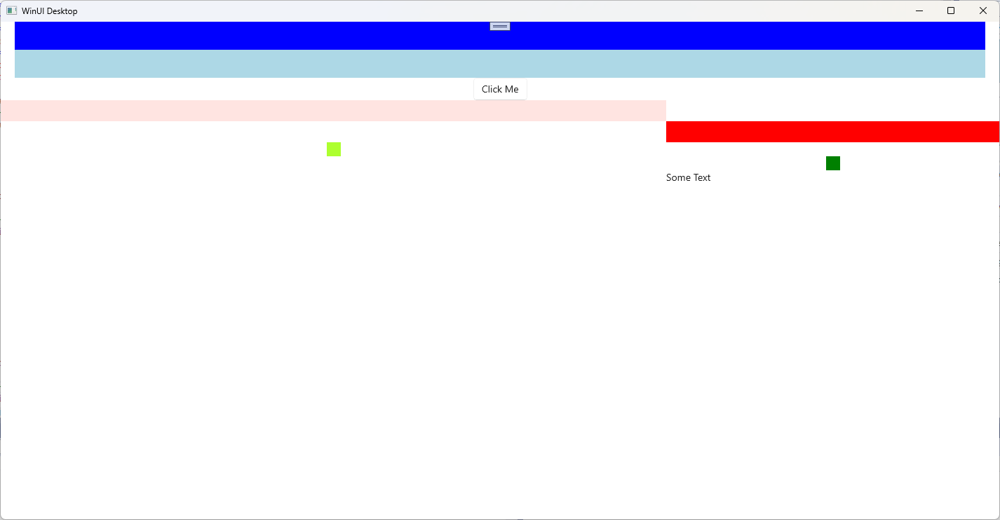

# DataGridExample

This solution is a place for me to learn about WinUI3 Layout, as well as store some of my learning so that I can refer back to it later. 

## Notes
* The Community Toolkit for WinUI 3 looks a little differetent ([link](https://learn.microsoft.com/en-us/answers/questions/1163807/cant-add-microsoft-toolkit-uwp-ui-controls-datagri))
* For the DataGrid example, here are some helpful links:

	* DataGrid Documents [link](https://learn.microsoft.com/en-us/windows/communitytoolkit/controls/datagrid_guidance/datagrid_basics)
	* Explanation of filling the grid with data [link](https://stackoverflow.com/questions/54110851/the-documentation-about-datagrid-on-uwp-is-not-clear)

## Day Two
* Implemented a DataGrid example from the **Windows Community Toolkit**

## Day One 
* Some different layouts of cells within a grid. 

___(2023-11-18)___
